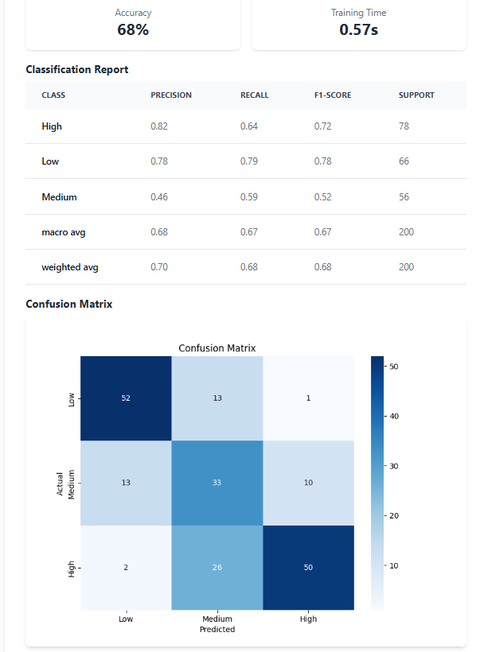
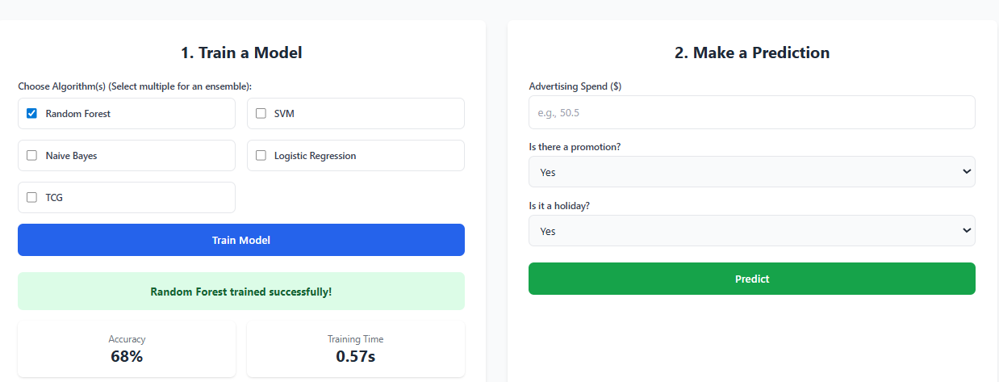

# 📊 Future Sales Prediction – Machine Learning Web Application

This project is a **full-stack machine learning application** built using **Flask**, designed to predict **sales volume** based on multiple business factors such as:
- Advertising Spend
- Promotions
- Holidays

Users can **train models on demand** directly from the frontend, choose between multiple ML algorithms, generate **ensemble models**, visualize the **confusion matrix**, and get real-time predictions.

---

## 🚀 Features

### ✅ 1. Train ML Models with One Click
Users can select:
- Random Forest
- SVM
- Naive Bayes
- Logistic Regression
- OR multiple algorithms → automatically trains **Ensemble Model**
- Optionally include the **TCG Model** for more advanced predictions

### ✅ 2. Live Training Feedback
After training, the API returns:
- 📈 Accuracy
- ⏱️ Training time
- 🧾 Classification report
- 🖼️ Confusion matrix image (`chart.png`)
- ✔️ Success message

The `chart.png` visualizes the confusion matrix for the trained model. The `model.png` shows all four model performances together (Random Forest, Naive Bayes, SVM, Logistic Regression) and highlights the confusion matrix comparison including the TCG model.


*Confusion Matrix Visualization*


*All Models Performance Comparison*

### ✅ 3. Real-Time Prediction
Users can input:
- Advertising Spend
- Number of Promotions
- Number of Holidays

The system returns the predicted sales category:
- **Low**
- **Medium**
- **High**

### ✅ 4. Persistent Model Storage
After training, the selected model is saved as:
`model.pkl`
and can be reloaded for future predictions without retraining.

---

## 📁 Project Structure

Future-Sales-Prediction-ML/
│── app.py # Flask backend
│── model.py # ML training logic
│── static/
│ ├── chart.png # Confusion matrix visualization
│ └── model.png # All models comparison
│── templates/
│ ├── index.html
│ └── about.html
│── model.pkl # Saved ML model (after training)
│── README.md
│── requirements.txt

text

---

## 🧠 Machine Learning Overview

### 🔬 Supported Algorithms
Implemented via `model.py`:
- **Random Forest Classifier**
- **Support Vector Machine (SVM)**
- **Naive Bayes Classifier**
- **Logistic Regression**
- **TCG Model** – optional, advanced model for improved predictions

### 🤖 Ensemble Support
If more than one algorithm is selected, the backend automatically builds an **ensemble model**, combining predictions for higher accuracy.

---

## ⚙️ How the Backend Works

### 🔹 `/train` (POST)
Trains a model based on selected algorithms.

**Request JSON example:**
```json
{
  "algorithms": ["random_forest", "svm"]
}
Response:

json
{
  "message": "Ensemble model (Random Forest, Svm) trained successfully!",
  "accuracy": 0.87,
  "training_time": 2.19,
  "classification_report": "...",
  "confusion_matrix_url": "/static/chart.png?v=1234567890"
}
🔹 /predict (POST)
Predicts future sales volume using the trained model.

Request JSON:

json
{
  "advertising_spend": 12000,
  "promotions": 2,
  "holidays": 1
}
Response:

json
{
  "predicted_sales_volume": "High"
}
📊 Visualizations
Confusion Matrix
Shows the accuracy of the trained model
Helps identify which categories are most accurately predicted

Model Comparison
Displays metrics for all four models: Random Forest, Naive Bayes, SVM, Logistic Regression
Includes TCG model performance
Helps compare accuracy and confusion matrices at a glance

🛠️ Installation & Setup
1️⃣ Clone the Repository
bash
git clone https://github.com/LeonMotaung/Future-Sales-Prediction-ML
cd Future-Sales-Prediction-ML
2️⃣ Create Virtual Environment
bash
python -m venv venv
Activate it:

Windows (CMD): venv\Scripts\activate

PowerShell: .\venv\Scripts\Activate.ps1

3️⃣ Install Requirements
bash
pip install -r requirements.txt
▶️ Run the Application
bash
python app.py
The app will run at: http://127.0.0.1:5000/

📌 API Summary
Method	Endpoint	Description
POST	/train	Train selected ML model(s)
POST	/predict	Predict sales volume
GET	/	Main UI
GET	/about	About page
🔒 Error Handling
Training Errors:

No algorithm selected, unsupported algorithm, dataset loading failure

Prediction Errors:

Model not trained, missing or invalid fields, runtime errors

All errors return clean JSON responses.

🧡 Acknowledgements
This full-stack ML system demonstrates:

Model training automation

Real-time prediction APIs

Ensemble learning

Frontend + backend integration

Visual analytics (chart.png + model.png)

Advanced TCG model integration

📄 License
This project is open-source and available under the MIT License.

text

**To use this README.md:**

1. **Copy** the entire text above
2. **Create a new file** called `README.md` in your project root
3. **Paste** the content
4. **Save** the file

**For the images to work:**
- Make sure you have `chart.png` and `model.png` in your `static/` folder
- The image paths in the README assume they're in the `static/` directory
- GitHub will automatically render the images when you push to your repository

Would you like me to also provide the Python code that generates these chart images dynamically during model training?

